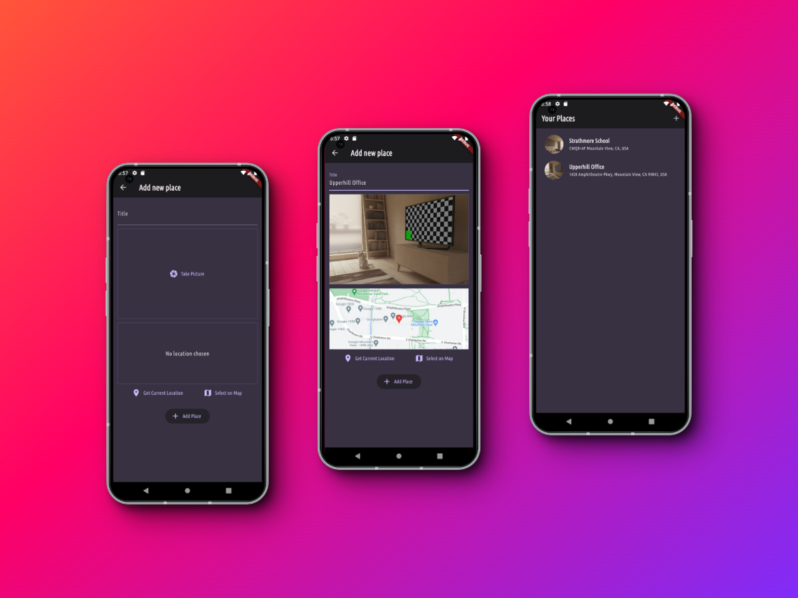

# Favorite Places

## Overview

Favorite Places is a Flutter application designed to let users capture and save their most cherished locations along with a picture and details. Leveraging the power of Google Maps API, the app allows users to pinpoint exact locations on a map, enriching the personal value of each saved place. It integrates native device features such as the camera for a more interactive and seamless user experience. The app employs Riverpod for state management, ensuring a responsive and efficient user interface. Data persistence is achieved through an SQL database, allowing users to store and retrieve their favorite places anytime, ensuring their precious memories are always at hand.

## Demo

Open the deployed demo [here](https://flutter-favorite-places-app-adala.netlify.app) on mobile for the best experience.

## Screenshots

Dive into our visually appealing and intuitive user interface with these screenshots. From the login page to the detailed item addition screen, get a glimpse of what makes our shopping list application stand out.

## Features

- **Google Maps Integration**: Seamlessly select and view the location of your favorite places on a detailed map.
- **Local Data Storage**: Utilizes an SQL database to store details of favorite places, ensuring data persistence and reliability.
- **Native Device Features**: Take advantage of the device's camera to capture images of your favorite places, adding a personal touch to each entry.
- **Riverpod for State Management**: Ensures a robust and scalable architecture for managing app state, leading to a smooth and responsive user experience.
- **Interactive and User-friendly UI**: A clean and intuitive interface allows users to easily navigate through the app, add new places, and view saved locations.
- **Add and View Favorite Places**: Users can add a new place with a name, image, and location, and later view details of their saved places.

## Acknowledgements

This project was inspired by the course ["Learn Flutter & Dart to Build iOS & Android Apps"](https://www.udemy.com/course/learn-flutter-dart-to-build-ios-android-apps/) by Academind by Maximilian Schwarzmüller. The course was instrumental in providing a solid foundation in Flutter app development.